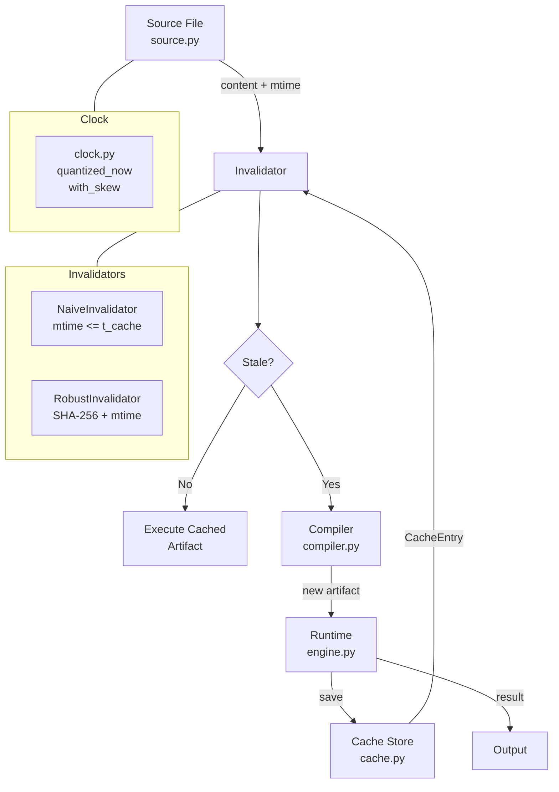

# StaleByte

<div align="center">


**Compiled Cache Staleness — Silent Runtime Behavior Mismatch, Detected.**

*A deterministic systems laboratory proving why timestamp-based build cache validation is provably broken, and how SHA-256 content-addressing fixes it.*

</div>

---

## The Problem: Silent Correctness Bugs in Build Caches

Build tools use filesystem modification timestamps (`mtime`) as a cheap proxy to decide whether to recompile source files. When `source.mtime <= t_cache`, the build system assumes nothing changed and reuses the cached artifact. **This assumption is wrong in ways that are silent, intermittent, and catastrophic.**

```
Source edited: factor=3    Cached artifact: factor=2
mtime = 1700000000.0       t_cache = 1700000000.0
         |___ EQUAL __________| Naive says: CACHE HIT
                                  Actual output: 20  (expected 30)
                                  Error logged: none
```

### The Two Failure Modes StaleByte Proves

| Failure Mode | Mechanism | Real-World Occurrence |
|---|---|---|
| **Timestamp Resolution Collision** | Source edited within the filesystem's 1–2s resolution window; new and old file share the same `mtime` | GNU Make on FAT32/NFS, Python `.pyc` reuse, CI pipelines with fast build loops |
| **Clock Skew** | Build machine and run machine clocks differ; source `mtime` appears older than `t_cache` even after editing | Distributed CI/CD, Docker builder nodes, NTP drift in k8s clusters |

> **Both failures are undetectable by the naive checker. Both are reliably detected by SHA-256.**

---

## Live Demo

```bash
python demo.py
```

```
========================================================================
  STALEBYTE — Compiled Cache Staleness Detection Demo
========================================================================

[SCENARIO 1: Sub-Second Timestamp Resolution Collision (1.0s Window)]
  Source V1 (factor=2) compiled, cached at mtime=1700000000.0
  Source edited to V2 (factor=3) +0.4s later — mtime still 1700000000.0

  [NAIVE INVALIDATOR]
    Decision  : is_stale=False   <- CACHE HIT
    Execution : Output = 20
    Verdict   : FAIL — Silent runtime mismatch (expected 30)

  [ROBUST INVALIDATOR]
    Decision  : is_stale=True    <- CACHE MISS (hash mismatch detected)
    Action    : Stale cache invalidated -> Recompiled from V2
    Execution : Output = 30
    Verdict   : PASS — Staleness detected and corrected

[SCENARIO 2: Clock Skew]
  Build clock: 1700000100.0 | Run clock: 1700000050.0 (50s behind)
  Source edited to V2 — mtime appears OLDER than t_cache

  [NAIVE INVALIDATOR]  -> FAIL   Output = 20 (stale)
  [ROBUST INVALIDATOR] -> PASS   Output = 30 (correct)

========================================================================
  EVALUATION SUMMARY: Naive Failures: 2/2 | Robust Passes: 2/2
========================================================================
```

---

## Statistical Proof: Fuzz Testing at Scale

StaleByte runs 10,000 randomized trials (varying clock resolutions, skew offsets, and content mutations) to quantify the failure rate empirically:

```bash
python cli.py fuzz --trials 10000 --seed 42 --json
```

| Validator | Silent Failures | Failure Rate |
|---|---|---|
| `NaiveInvalidator` (mtime only) | **6,390 / 10,000** | **63.9%** |
| `RobustInvalidator` (SHA-256) | **0 / 10,000** | **0.0%** |

> A build system using naive timestamp validation silently executes the wrong program in **nearly two-thirds of adversarial conditions.**

---

## Architecture



### Components

| Module | Role |
|---|---|
| `clock.py` · `VirtualClock` | Controllable clock with configurable resolution (e.g. 1.0s FAT32) and skew offset |
| `source.py` · `SourceFile` | Encapsulates content, byte size, SHA-256 fingerprint, and VirtualClock-driven `mtime` |
| `cache.py` · `CacheStore` | Atomic disk persistence storing bytecode + full provenance (`cached_mtime`, `content_hash`, `build_id`) |
| `invalidators.py` · `NaiveInvalidator` | Compares `source.mtime <= cached.mtime` — the standard flawed algorithm |
| `invalidators.py` · `RobustInvalidator` | Compares `source.content_hash == cached.content_hash` with collision-type diagnostics |
| `runtime/engine.py` · `Runtime` | Polymorphic engine: `execute(source, invalidator, input_val)` |
| `compiler.py` | Stack-based DSL interpreter; sandboxed, no `eval` or `exec` |
| `services/ai_service.py` | Meta Muse Spark 1.3 integration — AI-powered diagnostic explanation via SSE |
| `web/app.py` | HTTP API server: simulation, file upload staleness check, streaming chat |
| `fuzz.py` | Randomized trial harness with statistical reporting and JSON export |
| `cli.py` | `build`, `check`, `clean`, `demo`, `fuzz` subcommands |

---

## Web Interface

```bash
python web/app.py
# Open http://localhost:8000
```

The browser dashboard provides:

- **Live simulation** — `POST /api/run/collision` and `/api/run/skew` run both invalidators and return side-by-side diagnostics
- **File upload staleness check** — upload any `.src` file and get a real cache decision from the Robust validator
- **AI explanation** — `POST /api/explain` calls Meta Muse Spark 1.3 to explain any `InvalidationDecision` in plain English
- **Streaming chat** — `POST /api/chat` with `stream: true` for SSE-based conversation about cache staleness

---

## Installation & CLI Setup

Install StaleByte in editable mode to expose the `stalebyte` command directly:

```bash
git clone https://github.com/charanjalluri/StaleByte.git
cd StaleByte/stalebyte

# Activate virtual environment
python -m venv .venv
.venv\Scripts\activate        # Windows
source .venv/bin/activate       # macOS / Linux

# Install editable package
pip install -e .
```

---

## CLI Reference

The `stalebyte` command provides a unified interface for staleness checking, builds, demos, and fuzz testing:

```bash
# Check if the cached artifact is stale
stalebyte check path/to/program.src

# Build a source file and cache the artifact
stalebyte build path/to/program.src --input 10

# Run the scripted collision & clock skew demo
stalebyte demo

# Run fuzz trials and print statistics
stalebyte fuzz --trials 10000 --seed 42

# Machine-readable JSON fuzz output
stalebyte fuzz --trials 10000 --json

# Remove all cached artifacts
stalebyte clean
```

### Semantics of `stalebyte check <path>`

`stalebyte check <path>` computes the current content hash (SHA-256) of the file at `<path>`, compares it against StaleByte's own stored cache entry from the last time it was checked, and reports whether the content has genuinely changed — independent of file timestamps.

- **Exit code `0`**: Cache is valid and up to date (no staleness detected), OR no baseline cache exists yet on disk (informational notice displayed; does not block initial adoption).
- **Exit code `1`**: Staleness is detected (file content has changed compared to its stored cache baseline; rebuild required).

### Roadmap & Scope

> [!IMPORTANT]
> StaleByte is a standalone content-addressable cache primitive. In this version, it does **NOT** integrate with or inspect any other tool's existing build cache (no `__pycache__`, Docker layer, or GNU Make integration in this version).

**Roadmap items:**
- [ ] Direct inspection and verification of external build caches (`__pycache__`, GNU Make, Docker layers)
- [ ] Transitive multi-file dependency graph DAG invalidation
- [ ] Remote cache backends (S3, GCS, content-addressable CAS stores)
- [x] Pre-commit hook integration for git repository staleness audits (`.pre-commit-hooks.yaml`)

---

## Pre-Commit Hook Integration

StaleByte includes a pre-commit hook (`stalebyte-check`) to verify cache freshness and prevent committing stale artifacts.

### Usage in Another Repository

Add StaleByte to your target repository's `.pre-commit-config.yaml`:

```yaml
repos:
  - repo: https://github.com/charanjalluri/StaleByte.git
    rev: v1.3.0  # Use latest release tag or commit SHA
    hooks:
      - id: stalebyte-check
```

### Hook Specifications

| Property | Value | Description |
|---|---|---|
| **Hook ID** | `stalebyte-check` | Identifier referenced in `.pre-commit-config.yaml` |
| **Entry Point** | `stalebyte check .` | Recursively inspects all `.src` files in the repository |
| **Exit Code 0** | Clean / Initial Baseline (Pass) | Cache matches current content SHA-256 hashes, or no baseline exists yet (commit succeeds) |
| **Exit Code 1** | Stale / Rebuild Required (Fail) | Content was modified without rebuilding cache — aborts commit |

### Installation & Local Run

```bash
# 1. Install pre-commit in your environment
pip install pre-commit

# 2. Install git hook scripts into .git/hooks/
pre-commit install

# 3. Test manually across all files
pre-commit run stalebyte-check --all-files
```

---

## Test Suite

```bash
python -m pytest tests/ -v
```

**131 tests, 0 failures, 0 warnings.**

| Test Category | Tests | What Is Proven |
|---|---|---|
| AI Service | 8 | Streaming SSE, error handling, key lookup, summary fallback |
| Cache Manager | 8 | Save/load integrity, invalidation, malformed input |
| Cache Store | 3 | Full CacheStore lifecycle, corrupt file warning, thread concurrency |
| CLI and Real Filesystem | 11 | Real `os.stat()` mtimes, `os.utime()` collision, recursive scan, pre-commit |
| Clock Skew | 4 | Naive vs Robust divergence under skewed mtime |
| Compiler & Bytecode VM | 14 | DSL parsing, factor validation, bytecode stack interpreter |
| Statistical Fuzzing | 4 | 2,000-trial failure rates, JSON output, CLI integration |
| SHA-256 Hash | 5 | Stability, sensitivity, empty string, case-sensitivity |
| Invalidators | 4 | Resolution collision, clock skew, both invalidators |
| Naive Checker | 5 | All boundary conditions; collision flaw proof |
| Runtime End-to-End | 4 | Naive returns 20 (stale), Robust returns 30 (correct) |
| Simulation Service | 4 | All three scenarios, status endpoint |
| Robust/Smart Checker | 6 | Collision detection, no false rebuilds, all decision fields |
| Source File | 2 | Fingerprinting, mtime from clock |
| Timestamp Boundary | 10 | Exhaustive boundary-value tests for both invalidators |
| Unified Runtime | 2 | Pluggable invalidator collision scenario |
| Upload Check | 6 | Full upload lifecycle, validation rejections |
| Virtual Clock | 3 | Resolution window boundary, skew offset |
| Web API | 28 | All HTTP routes, streaming chat, static HTML, error handling |

---

## Quick Install

```bash
git clone https://github.com/charanjalluri/StaleByte.git
cd StaleByte/stalebyte

python -m venv .venv
.venv\Scripts\activate        # Windows
source .venv/bin/activate       # macOS / Linux

pip install -e .
stalebyte demo
```

**Runtime requirements:** Python 3.8+, standard library only (no external dependencies beyond `pytest` for testing).

---

## Configuration

StaleByte works out of the box with zero external configuration. For optional AI features (natural-language explanation of cache invalidations and streaming chat), configure your environment variables:

1. Copy the environment template:
   ```bash
   cp .env.example .env
   ```
2. Edit `.env` with your API configuration:
   - `MUSE_SPARK_API_KEY`: API key for interactive chat and on-demand explanations (Meta Muse Spark 1.3 OpenAI-compatible endpoint).
   - `SUMMARY_API_KEY`: Dedicated API key for automatic route result summaries (provides quota isolation).
   - `META_API_BASE_URL`: API base URL (defaults to `https://api.meta.ai/v1`).
   - `META_MODEL_ID`: Model identifier (defaults to `muse-spark-1.3`).

> [!NOTE]
> If no API keys are provided, StaleByte runs completely and deterministically in fallback mode.

---

## Key Results at a Glance

| Metric | Value |
|---|---|
| Naive invalidator silent failure rate (10,000 trials) | **63.9%** |
| Robust invalidator failure rate | **0.0%** |
| Automated test count | **131 passed** |
| Real-disk timestamp collision reproduced via `os.utime()` | **Yes** |
| AI diagnostic explanation | **Meta Muse Spark 1.3** |
| Web API endpoints | **8** |
| CLI subcommands | **5** |

---

## Why Content-Addressable Caching Is the Industry Answer

StaleByte makes a well-known principle tangible and measurable:

- **Bazel** uses SHA-256 of all transitive inputs for remote cache keys
- **Nix** uses cryptographic hashes of source and build environment to guarantee reproducibility
- **Python 3.8+** added `--check-hash-based-pycs` specifically because `.pyc` mtime bugs caused silent failures in production
- **Git** identifies blobs by SHA-1/SHA-256, never by `mtime`
- **CMake** adopted content-based dependency tracking in v3.20+ (`CMAKE_EXPORT_COMPILE_COMMANDS`)

StaleByte proves this tradeoff is not theoretical — it is **measurable, reproducible, and fixable**.

---

<div align="center">
<sub>Every claim in this README is backed by a passing test in <code>tests/</code>. Every number came from an actual run.</sub>
</div>
