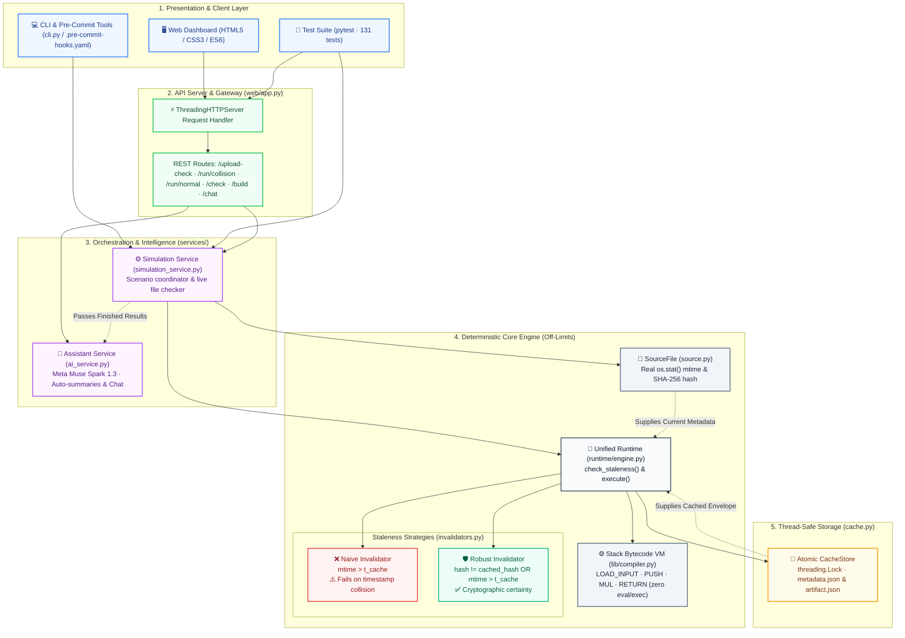
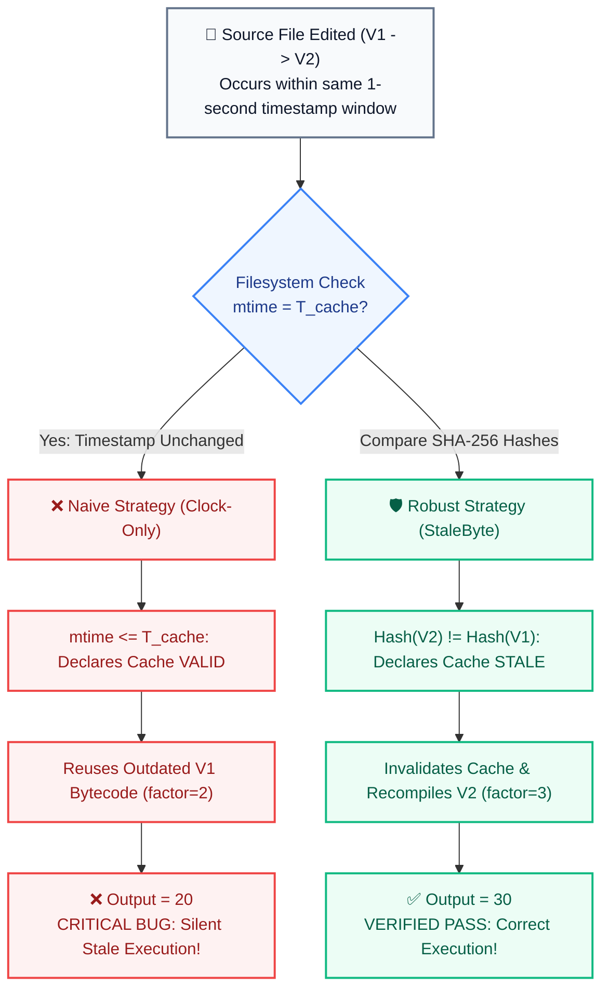

# StaleByte — System Architecture

## 1. Executive Summary

StaleByte is a deterministic verification engine demonstrating **compiled-cache staleness caused by timestamp validation failure** and its resolution via **SHA-256 cryptographic content fingerprinting**.

Build systems traditionally rely on file modification timestamps (`mtime`) to skip unnecessary recompilation. However, when edits occur within the filesystem timestamp resolution window (e.g. 1-second FAT32/ext3 granularity, sub-second rapid rebuilds, or distributed clock skew), two distinct source versions can have identical observable timestamps. A timestamp-only validator incorrectly reuses a stale binary, resulting in silent runtime behavioral divergence.

StaleByte implements a dual-invalidation architecture to reproduce this critical vulnerability deterministically, contrast naive vs. robust strategies side by side, and provide verifiable cryptographic certainty.

---

## 2. Complete System Architecture Diagram

---

## 3. Naive vs. Robust Decision Flow

---

## 4. Component Deep Dive

### 4.1 Presentation Layer (`web/static/`)
- **Dashboard Interface**: Single-page application built with clean semantic HTML5, custom design system CSS (responsive, glassmorphism accents, accessible contrast ratios), and vanilla ES6 JavaScript.
- **Simulation Suite**: One-click triggers for:
  - Timestamp Collision scenario (identical filesystem mtime, diverging content)
  - Normal Flow scenario (unchanged source, legitimate cache hit)
  - Distributed Clock Skew scenario (backward clock skew simulating unsynchronized cluster nodes)
- **Real File Upload Dropzone**: Drag-and-drop file inspection executing real `os.stat` filesystem calls and live SHA-256 generation.
- **Assistant Widget**: Non-intrusive floating drawer offering natural language explanations without technical jargon.

### 4.2 Application & Service Layer (`web/app.py`, `services/`)
- **API Server (`web/app.py`)**: High-performance HTTP server using Python's standard library `ThreadingHTTPServer`. Enforces strict request body validation (1MB upload limit, RFC-compliant Content-Length on error responses).
- **Simulation Service (`services/simulation_service.py`)**: Pure orchestration layer isolating business logic from network handlers. Supplies structured diagnostic payloads with verdicts, timestamps, hashes, and decisions.
- **AI Intelligence Service (`services/ai_service.py`)**:
  - Encapsulated Meta Muse Spark 1.3 LLM client over standard OpenAI-compatible completions protocol.
  - **Quota Isolation**: Independent `MUSE_SPARK_API_KEY` (interactive chat) and `SUMMARY_API_KEY` (automatic core output summaries).
  - **Graceful Fault Tolerance**: Background summary failures or missing keys safely fall back to `null` with HTTP 200, guaranteeing deterministic core execution never halts.
  - **Plain-Language Tone**: Strict system prompt constraints forbidding raw math operators (`<=`, raw bytecode) for business and non-technical clarity.

### 4.3 Deterministic Core Layer (`invalidators.py`, `source.py`, `cache.py`, `runtime/`, `lib/`)
- **Source Model (`source.py`)**: Encapsulates disk-backed and in-memory source files. Calculates SHA-256 digests deterministically. Supports `VirtualClock` for discrete time resolution quantization.
- **Cache Store (`cache.py`)**: Thread-safe cache persistence using `threading.Lock` and atomic file write replacements (`_atomic_write_text` via temp files).
- **Pluggable Invalidators (`invalidators.py`)**: Polymorphic validator interface implementing `check(source, cache_entry) -> InvalidationDecision`.
- **Compiler & Bytecode VM (`lib/compiler.py`)**: Safe stack machine supporting arithmetic transformations without dynamic interpreters (`eval`, `exec`).

### 4.4 CLI & Pre-Commit Integration (`cli.py`, `.pre-commit-hooks.yaml`)
- **CLI Subcommands**: `stalebyte check <path>`, `build`, `demo`, `fuzz`, and `clean`.
- **Recursive Directory Inspection**: `stalebyte check <directory>` walks all `.src` files recursively, skipping hidden and cache directories. Returns exit code `0` on clean state or unbuilt initial baseline, and exit code `1` if any file is genuinely stale.
- **Pre-Commit Hook**: Integrates via `.pre-commit-hooks.yaml` (`id: stalebyte-check`, `entry: stalebyte check .`), preventing commits of modified source files without updated cache baselines.

---

## 5. Security & Reliability Model

- **Safe Execution**: Stack VM operations (`LOAD_INPUT`, `PUSH`, `MUL`, `RETURN`) prevent code injection.
- **Atomic Concurrency**: Thread-safe write locks prevent corrupted cache files during concurrent build requests.
- **Air-Gapped Core Determinism**: All staleness decisions (`is_stale`, `rebuilt`, `output`) are 100% deterministic and computed locally before optional AI presentation layers are invoked.
